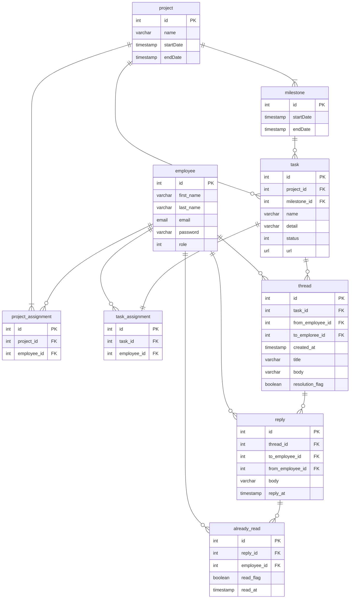
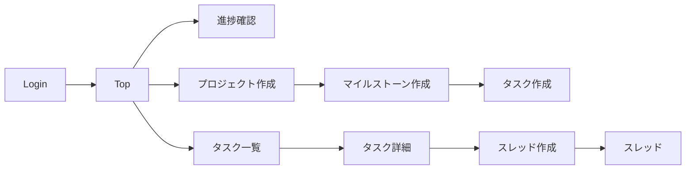

# ポートフォリオ作成(作成中)
- GoとNextJSを利用して、タスク管理システムを作成する。DDDの設計も取り入れながら実装する。
## 使用技術
- go version go1.19 darwin/amd64
    - サードパーティーパッケージ
        - go get github.com/mattn/go-sqlite3
        - go get "gopkg.in/go-ini/ini.v1"
        - go get "github.com/google/uuid"
        - go get github.com/asaskevich/govalidator
- node v18.15.0

## リポジトリ階層
```
Backend
├ config/
├ domain/
│  └ models/
│     ├ employee/ .. 従業員ドメイン(値obj, エンティティ, ドメインサービス格納)
│
├ enum/
├ iterrors/ .. エラーハンドリング
├ utils/ .. log設定
├ README.md
├ config.ini
└ main.go
```

## TaskNavigator

- エンジニア向けのタスク管理システム
- WHO：SEとPG
- WHAT：タスク・ステータス・進捗の管理、タスクに紐づくスレッドないでの質問・コメント

### ユースケース
1. SE:PJ作成
2. SE:マイルストーン作成
    - 最長3ヶ月まで
    - 同時並行可能
    - タスク：マイルストーン = n：１
3. SE:タスク登録・管理
    - タスク：PG = １：１
4. PG:タスク確認
5. PG:ステータス変更
    - 未着手
    - 作業中
    - レビュー依頼中
    - レビュー中
    - 完了
6. SE:進捗を管理
7. SE/PG:タスクに紐づくスレッドで会話

### ER図


### 画面遷移図



## 参考リンク
[Next.js と Go で WebSocket 通信を行おう【環境構築編】](https://qiita.com/1129-tame/items/39101ed81039542198dc)